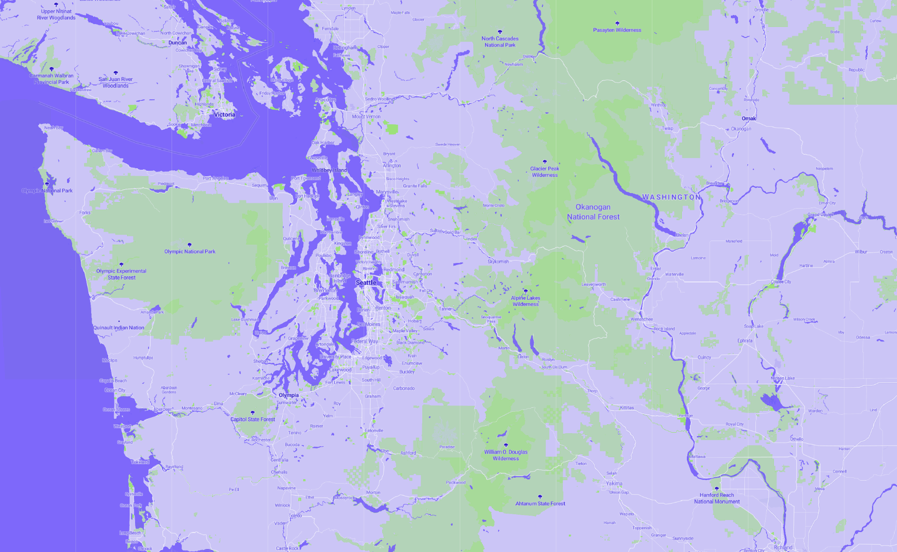
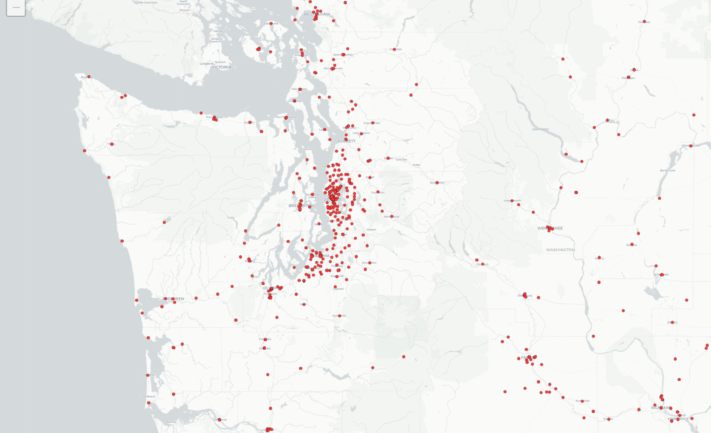
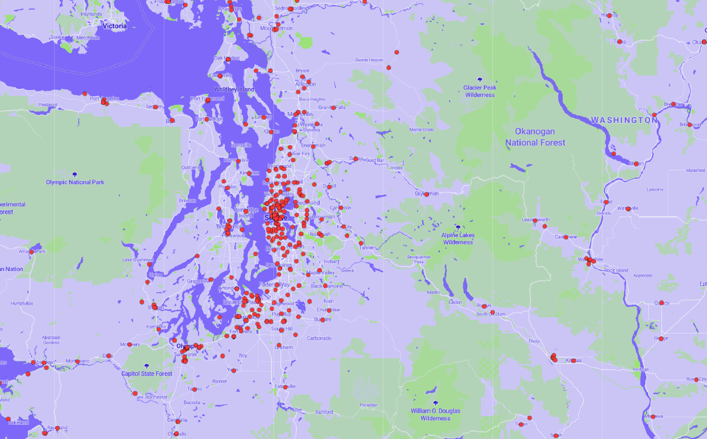
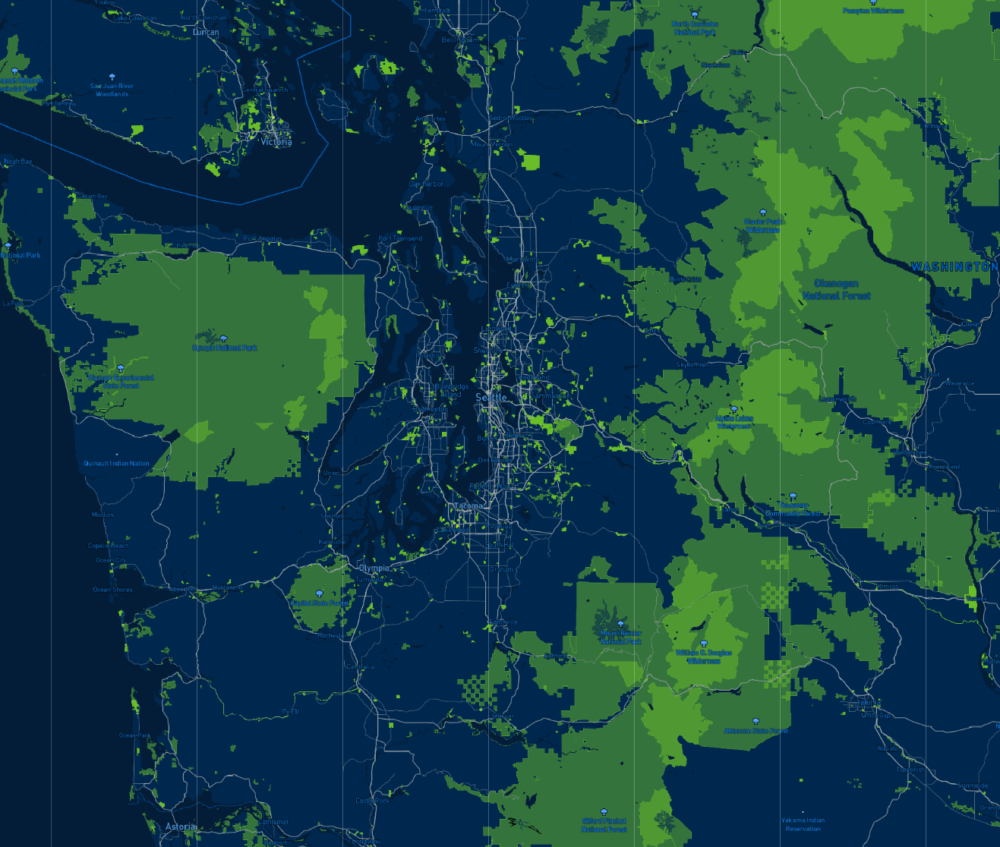

# Custom Map Tiles With Mapbox

## Tile 1: Basemap

**Examined geographic area:** Washington State
**Available zoom levels:** 8-10

**Description**: the above basemap is based on the Mapbox 'Monocrome' template style. To make the basemap more colorful and visually appealing, alterations were made to the color to reflect a purple theme instead of the default blue. Additionally, forrest areas/green spaces are displayed as the green patches on the map. Small changes were also made to the font used in the map.

## Tile 2: Library Locations

**Examined geographic area:** Washington State
**Available zoom levels:** 8-10

**Description**: this map shows the points of libraries located within Washington State. The data was taken from the Washington Geospatial Open Data website, and can be found through the following link here: https://geo.wa.gov/datasets/washington-library-locations?showData=true

The data points were imported as a tileset into Mapbox studio, and then converted to map tiles through QGIS.

## Tile 3: Basemap and Library Data

**Examined geographic area:** Washington State
**Available zoom levels:** 8-10

**Description**: this map displays a combination of the previous two maps, with the Library Locations layer placed on top of the basemap.

## Tile 4: Seahawks Theme

**Examined geographic area:** Washington State
**Available zoom levels:** 8-10

**Description**: the above map was based on the Mapbox Studio 'Monocrome' style template, with the colors altered to reflect the colors of the Seattle Seahawks. The base map is the dark blue, the greenspace/forest area is the bright green, and the roads are colored silver.
